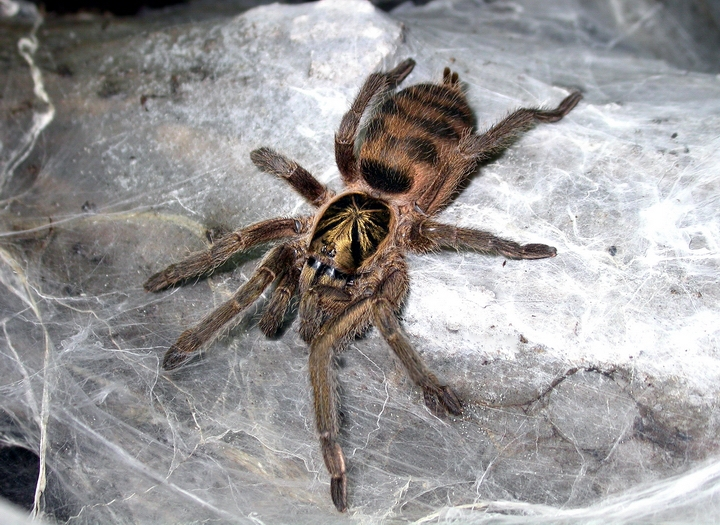

# neoholothele-incei-research-by-x7f15h7x
My research into the Trinidad Olive (Neoholothele incei)—beginning with observations of my own specimens as pets and expanding into the species as a whole.

*Image: "Neoholothele incei" by www.universoaracnido.com — Licensed under [CC BY SA 2.5](https://creativecommons.org/licenses/by/2.5/). Source: [https://wikipedia.com*](https://www.wikidata.org/wiki/Q4128025#/media/File:HOLOTHELE_INCEI_HEMBRA_GRAVIDA.jpg)

credit: Danny de Bruyne & [www.spidersworld.eu*](https://www.spidersworld.eu/)
